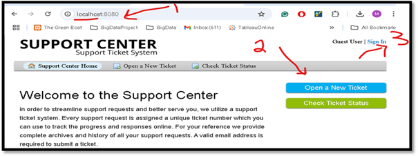
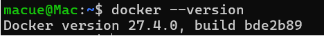
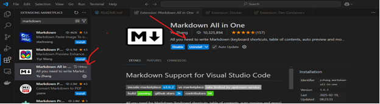
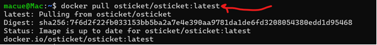
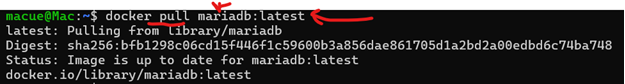
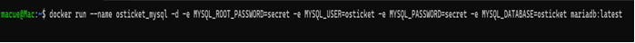
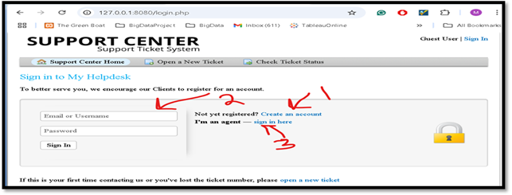
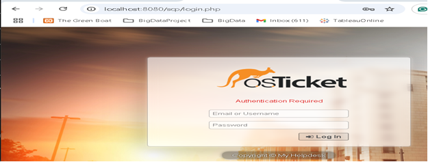

# OS Ticket Helpdesk Support System on Docker



## Overview

OS Ticket is an open-source helpdesk support platform that streamlines the submission and management of technical support requests. This guide demonstrates how to deploy OS Ticket using Docker containers for quick and easy setup.

## Prerequisites

- Windows x86_64 system
- Internet connection for downloading required components

## Installation Guide

### 1. Setup Docker Desktop

1. Download and install [Docker Desktop for Windows](https://docs.docker.com/desktop/setup/install/windows-install/)
2. Verify installation by running:
   ```bash
   docker --version
   ```
   

3. Install [VS Code](https://code.visualstudio.com/download) (optional for editing)
4. Add Markdown extension in VS Code for README editing (optional)
   

### 2. Pull Docker Images

1. Pull the OS Ticket application image:
   ```bash
   docker pull osticket/osticket:latest
   ```
   

2. Pull MariaDB database image for the backend:
   ```bash
   docker pull mariadb:latest
   ```
   

### 3. Configure and Run Containers

1. Create and configure the MariaDB container:
   ```bash
   docker run --name osticket_mysql -d -e MYSQL_ROOT_PASSWORD=secret -e MYSQL_USER=osticket -e MYSQL_PASSWORD=secret -e MYSQL_DATABASE=osticket mariadb:latest
   ```
   

2. Deploy the OS Ticket application container linked to the database:
   ```bash
   docker run --name osticket -d --link osticket_mysql:mysql -p 8080:80 campbellsoftwaresolutions/osticket
   ```
   

## Accessing OS Ticket

The OS Ticket portal should now be accessible at http://localhost:8080

### End-User Portal



As an end-user, you can:
1. Open a new support ticket
2. Sign in to your existing account
3. Create a new account

### Administrator Portal



Default admin credentials:
- Username: `ostadmin`
- Password: `Admin1`

## Testing Tasks

### End-User Portal Testing
1. Navigate to http://localhost:8080
2. Try creating a new ticket
3. Create a new user account or sign in with existing credentials

### Admin Portal Testing
1. Sign in to the admin portal using the default credentials
2. Explore ticket management features
3. Configure system settings and user permissions

## Version Control

Push your project to GitHub:
```
bash git push git@github.com:macueit3/osticket-system-helpdesk.git

```
## Security Notes

- Change default admin credentials immediately after first login
- Consider using environment variables or Docker secrets for sensitive information in production

## References

- [Docker Desktop Installation Guide](https://docs.docker.com/desktop/setup/install/windows-install/)
- [OS Ticket Docker Deployment Guide](https://mpolinowski.github.io/docs/DevOps/Provisioning/2022-10-16--os-ticket-docker/2022-10-16/)

## Author

**Macuei Mathiang Ring**
- MS in Information Technology (2019)
- BA in Computer Science (2013)
- Project completed as part of the ULEM MA workforce IT development program 2025
- [LinkedIn Profile](https://www.linkedin.com/in/macuei/)

## License

This project uses OS Ticket which is distributed under the GPL v2 license.
