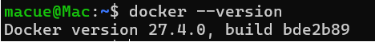
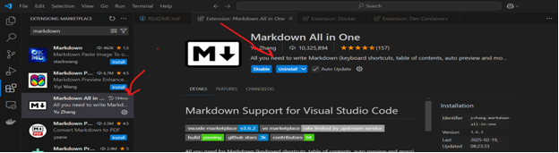
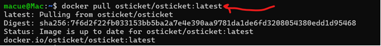
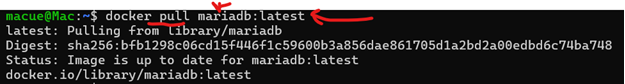
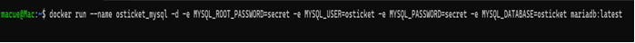
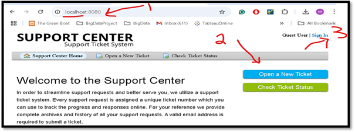
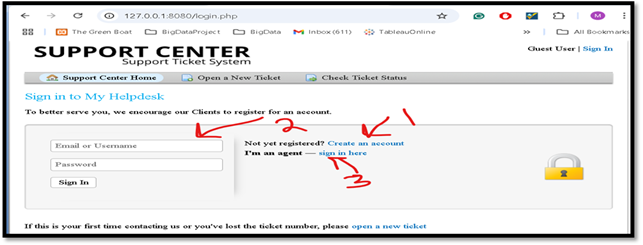
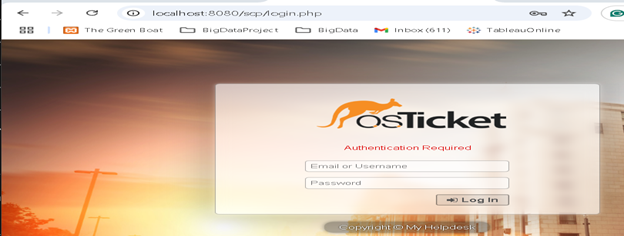

# OS Ticket Helpdesk Support System Deployment on Docker Container

# Description:
is an open source for support ticketing system used by employee to submit their technical issues related to daily business operations.

## 1. Download and install Docker Desktop:
  
   1) Docker Desktop for Windows_x86_64
      https://docs.docker.com/desktop/setup/install/windows-install/
   2) Verify if docker installed successfully using the following command:
    $ docker --version

  3) Microsft VS Code: 
     https://code.visualstudio.com/download
  4) Adding Markdown extension for README.md file writing:
   

## 2. Pull the OS Ticket app docker image from the hub.docker.com
$ docker pull osticket/osticket:latest 

## 3. Pull MairaDB database docker image to be used in back-end
$ docker pull mariadb: latest

## 4. Use docker command to create user, new database with credentials (username and password) in the installed MySQL database:

$ docker run --name osticket_mysql -d -e MYSQL_ROOT_PASSWORD=secret \
-e MYSQL_USER=osticket -e MYSQL_PASSWORD=secret -e MYSQL_DATABASE=osticket mariadb:latest

**Copy the below command** \
docker run --name osticket_mysql -d -e MYSQL_ROOT_PASSWORD=secret -e MYSQL_USER=osticket -e MYSQL_PASSWORD=secret -e MYSQL_DATABASE=osticket mariadb:latest 

### Should look like the below code on your command line/terminal:

## 5. Now, run both images to generate docker containers:

$ docker run --name osticket -d --link osticket_mysql:mysql -p 8080:80 campbellsoftwaresolutions/osticket

## 6. Now, the OS Ticket portal (End-User) should be ready for access localy at http:localhost:8080

## 7. Perform the following testing tasks following below instructions:

1)	Type: localhost:8080 to access the regular user or end-user portal
2)	Click to “Open a New Ticket” to create a new ticket
3)	Click on “Sign In” to your Help Desk Support OR Signup OR && Login page

## 8. Using the above portal, perform the following testing tasks:
1)	Click on Create an account link to sign up
2)	Provide your credentials if already a member
3)	Click Sign in here if you are an admin or an agent  go to administrator portal.

## 9. Login to your adminstrator portal/account

## 10. Push your project to github
- Pushing local git repository to specific remote repository on github.com
  
   $ git push [remote_ssh_repo_path]

   $ git push git@github.com:macdit3/osticket-system-helpdesk.git

  ## References:
- Dowloand and install Docker Deskotp: https://docs.docker.com/desktop/setup/install/windows-install/

- Provisioning OS Ticket on Docker Container: https://mpolinowski.github.io/docs/DevOps/Provisioning/2022-10-16--os-ticket-docker/2022-10-16/

## Authors and Acknowledgement:
- Macuei Mathiang, MS in Information Technology and BA in Computer Science 2013
- This project was completed as part of MA workforce IT development program 2025
- To learn more about the author, please visit his linkedin acocunt: https://www.linkedin.com/in/macuei/
  

